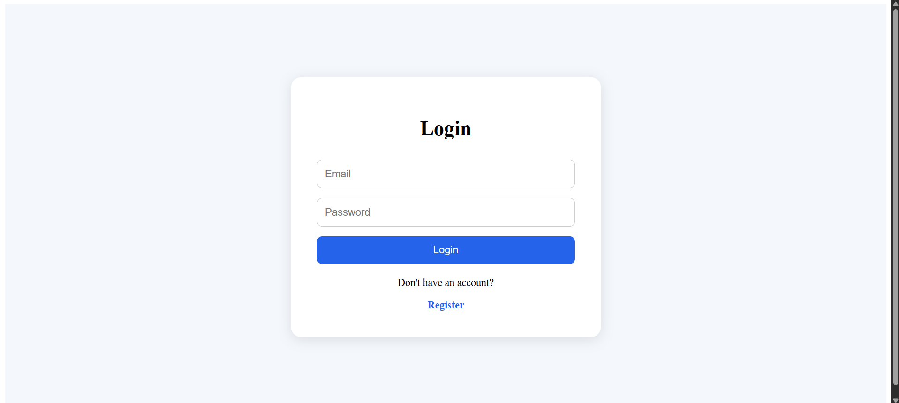
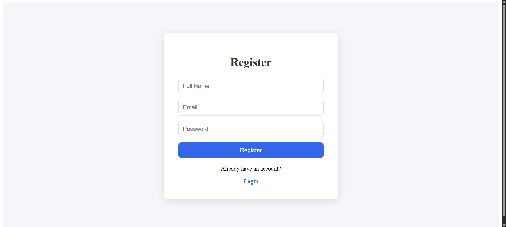
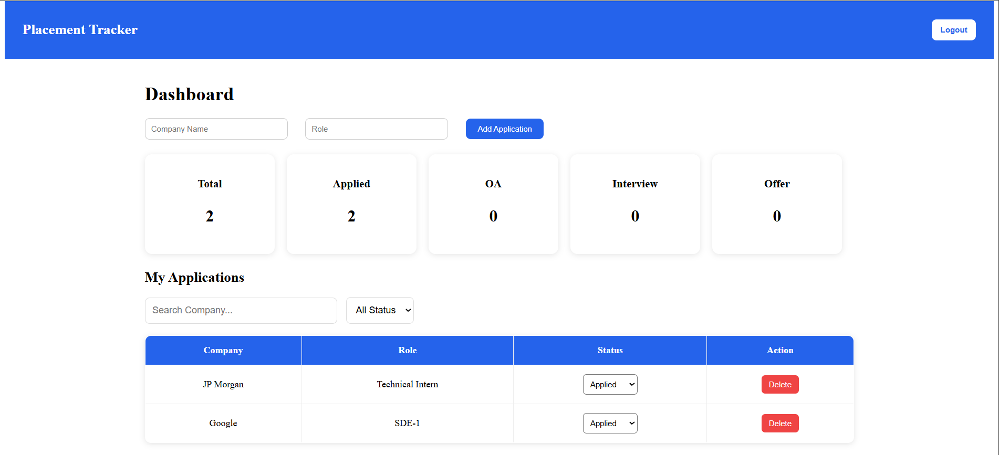

# Placement Tracker

A full-stack web application to track job and internship applications throughout the placement season.

## Features

* User Registration and Login
* JWT Authentication
* Protected Routes
* Add Applications
* Update Application Status
* Delete Applications
* Dashboard Statistics
* Search Applications
* Status Filtering
* Responsive User Interface

## Tech Stack

### Frontend

* React.js
* React Router
* Axios
* CSS

### Backend

* Node.js
* Express.js

### Database

* PostgreSQL

### Authentication

* JWT
* bcrypt

## Screenshots

### Login Page



### Register Page



### Dashboard



## Installation

### Clone Repository

```bash
git clone <repository-url>
```

### Backend Setup

```bash
cd backend
npm install
npm run dev
```

### Frontend Setup

```bash
cd frontend
npm install
npm run dev
```

## Environment Variables

Backend `.env`

```env
DATABASE_URL=your_database_url
JWT_SECRET=your_secret_key
```

Frontend `.env`

```env
VITE_API_URL=http://localhost:5000
```

## Project Structure

```text
frontend/
backend/
screenshots/
README.md
```

## Future Improvements

* Email Notifications
* Analytics Charts
* Application Notes
* Resume Upload
* Deployment Monitoring

## Author

Dheeraj Medapati
VIT-AP University
B.Tech Computer Science and Engineering
